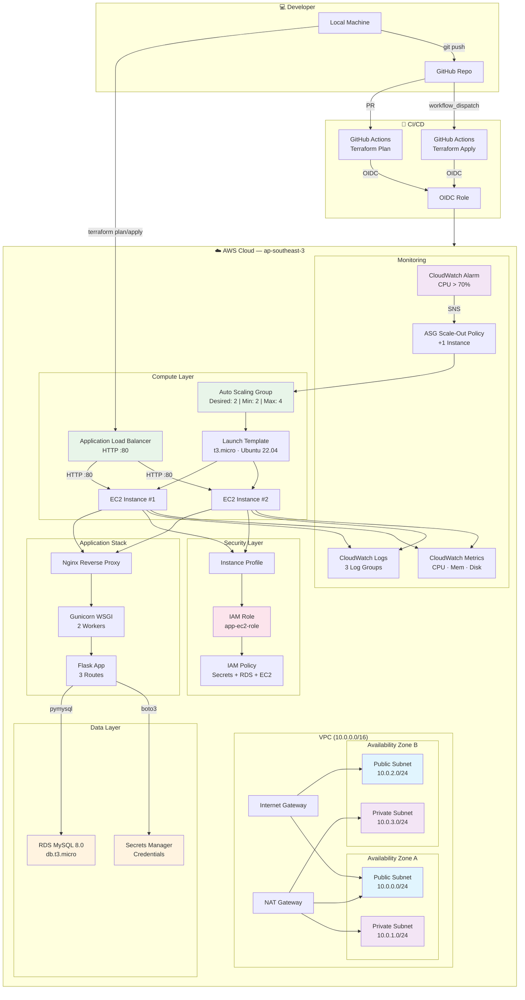

# 🚀 IaC Full Infra — Terraform Portfolio Project

[](https://www.terraform.io/)
[](https://aws.amazon.com/)
[](https://ubuntu.com/)
[](https://python.org/)
[](https://flask.palletsprojects.com/)
[](https://mysql.com/)

---

## 📋 Table of Contents

- [Overview](#-overview)
- [Architecture](#-architecture)
- [Features](#-features)
- [Project Structure](#-project-structure)
- [Prerequisites](#-prerequisites)
- [Quick Start](#-quick-start)
- [Modules](#-modules)
- [Application](#-application)
- [CI/CD Pipeline](#-cicd-pipeline)
- [Variables Reference](#-variables-reference)
- [Outputs Reference](#-outputs-reference)
- [Cost Estimate](#-cost-estimate)
- [Cleanup](#-cleanup)
- [Author](#-author)

---

## 🌐 Overview

**IaC Full Infra** is a production-grade Infrastructure as Code (IaC) portfolio project that provisions a **complete full-stack AWS infrastructure** using Terraform. It demonstrates industry best practices in IaC, including modular design, remote state management, secrets management, autoscaling, load balancing, monitoring, and CI/CD integration.

**Deploys:** VPC → EC2 / ASG → ALB → RDS → IAM → Secrets Manager → CloudWatch

---

## 🏗 Architecture



### Data Flow

1. **User** → ALB (port 80) → Nginx (reverse proxy) → Gunicorn (WSGI) → Flask App
2. **Flask App** → Reads DB credentials from **Secrets Manager** → Discovers RDS endpoint via tags → Connects to **RDS MySQL**
3. **EC2 instances** → Use **Instance Profile** (IAM Role) → Authorized to read secrets + describe RDS
4. **CloudWatch Agent** → Ships logs to **CloudWatch Logs** + custom metrics to **CloudWatch Metrics**
5. **CPU Alarm** → Triggers **ASG Scale-Out** (+1 instance) when CPU > 70%

---

## ✨ Features

### Infrastructure
| Feature | Detail |
|---------|--------|
| **VPC** | Custom CIDR (10.0.0.0/16), 2 AZs, public & private subnets, NAT Gateway |
| **Compute** | EC2 t3.micro (standalone) OR Auto Scaling Group (min 2, max 4) |
| **Load Balancer** | Application Load Balancer, HTTP:80, health check `/health` |
| **Database** | RDS MySQL 8.0, private subnet, Secrets Manager credentials |
| **IAM** | Least-privilege role & policy (Secrets Manager + RDS describe + EC2 describe) |
| **Monitoring** | CloudWatch Agent, CPU alarm → scale-out, log shipping |
| **State Mgmt** | Remote S3 backend + DynamoDB locking |
| **CI/CD** | GitHub Actions — Plan (PR) + Apply (manual dispatch) via OIDC |

### Application
| Feature | Detail |
|---------|--------|
| **Web Server** | Nginx reverse proxy → Gunicorn |
| **Framework** | Python Flask + Jinja2 templating |
| **Routes** | `/` (Dashboard UI), `/health` (JSON health), `/api/info` (JSON metadata) |
| **Dashboard** | System metrics (CPU, mem, disk, uptime), DB status, bootstrap logs |
| **DB Connect** | Auto-discovers RDS via tags, reads creds from Secrets Manager |
| **Bootstrap** | 236-line script (6 phases), falls back to minimal app if GitHub unreachable |

---

## 📁 Project Structure

```
iac-full-infra-terraform/
├── environments/
│   └── dev/                          # Dev environment
│       ├── main.tf                   # Root module — orchestrates all resources
│       ├── variables.tf              # Input variables with defaults
│       ├── outputs.tf                # Output values + connect commands
│       └── terraform.tfvars          # Variable values (customize here!)
│
├── modules/
│   ├── vpc/                          # VPC + subnets + IGW + NAT
│   │   └── main.tf, outputs.tf, variables.tf
│   ├── ec2/                          # EC2 instances (standalone mode)
│   │   └── main.tf, outputs.tf, variables.tf
│   ├── alb/                          # ALB + target group + listener
│   │   └── main.tf, outputs.tf, variables.tf
│   ├── asg/                          # Auto Scaling Group + launch template
│   │   └── main.tf, outputs.tf, variables.tf
│   ├── db/                           # RDS MySQL (private subnet)
│   │   └── main.tf, outputs.tf, variables.tf
│   ├── iam/                          # IAM role, policy, instance profile
│   │   ├── main.tf, outputs.tf
│   │   └── policy.json               # IAM policy document
│   └── secrets/                      # AWS Secrets Manager
│       └── main.tf, outputs.tf, variables.tf
│
├── scripts/
│   ├── bootstrap.sh                  # EC2 user_data script (236 lines, 8 KB)
│   └── app.py                        # Flask application (downloaded at runtime)
│
├── .github/
│   └── workflows/
│       ├── terraform-plan.yml        # Plan on PR
│       └── terraform-apply.yml       # Apply via manual dispatch
│
└── README.md                         # You are here
```

---

## 📋 Prerequisites

| Tool | Version | Purpose |
|------|---------|---------|
| [Terraform](https://developer.hashicorp.com/terraform/downloads) | ≥ 1.5.0 | Infrastructure provisioning |
| [AWS CLI](https://aws.amazon.com/cli/) | ≥ 2.x | AWS authentication |
| [Python 3](https://python.org/) | ≥ 3.8 | Local script validation (optional) |

### AWS Account Setup

1. **Create an AWS account** (if you don't have one)
2. **Create IAM user** with programmatic access + `AdministratorAccess` policy (for dev)
3. **Configure credentials:**
   ```bash
   aws configure
   # AWS Access Key ID: ************
   # AWS Secret Access Key: ************
   # Default region: ap-southeast-3
   # Default output: json
   ```

### S3 Backend (One-time Setup)

Before first deployment, create the remote state backend:

```bash
# Create S3 bucket
aws s3api create-bucket \
    --bucket iac-portfolio-tfstate-aqilsulthan-2025 \
    --region ap-southeast-3 \
    --create-bucket-configuration LocationConstraint=ap-southeast-3

# Enable versioning
aws s3api put-bucket-versioning \
    --bucket iac-portfolio-tfstate-aqilsulthan-2025 \
    --versioning-configuration Status=Enabled

# Create DynamoDB table for state locking
aws dynamodb create-table \
    --table-name terraform-locks \
    --attribute-definitions AttributeName=LockID,AttributeType=S \
    --key-schema AttributeName=LockID,KeyType=HASH \
    --billing-mode PAY_PER_REQUEST
```

> **Note:** If you want to use **local state** instead (no S3), comment out the `backend "s3"` block in `environments/dev/main.tf` and uncomment the `backend "local" {}` line.

---

## 🚀 Quick Start

### 1. Clone the Repository

```bash
git clone https://github.com/aqilsulthan/iac-full-infra-terraform.git
cd iac-full-infra-terraform
```

### 2. Customize Variables

Edit `environments/dev/terraform.tfvars`:

```hcl
# ⚠️ IMPORTANT: Set your IP address for security
app_ingress_cidr_blocks = ["YOUR_IP/32"]
# Find your IP: curl ifconfig.me or visit https://whatismyip.com

# Optional: customize database credentials
db_name     = "appdb"
db_username = "appuser"
db_password = "your-password"
```

### 3. Deploy

```bash
cd environments/dev

# Initialize Terraform (download providers + modules)
terraform init

# Preview changes
terraform plan -out=tfplan

# Apply (creates all AWS resources, ~5-10 minutes)
terraform apply tfplan
```

### 4. Access the Application

After deployment completes, find the ALB DNS name:

```bash
echo $(terraform output -raw alb_dns_name)
# → app-lb-123456789.ap-southeast-3.elb.amazonaws.com
```

Then open in browser:
- **Dashboard:** `http://<ALB_DNS>/`
- **Health Check:** `http://<ALB_DNS>/health`
- **API Info:** `http://<ALB_DNS>/api/info`

Or use curl:
```bash
curl http://$(terraform output -raw alb_dns_name)/
curl http://$(terraform output -raw alb_dns_name)/health
```

### 5. Connect to Database (Optional)

```bash
mysql -h $(terraform output -raw db_endpoint) -u appuser -p
```

---

## 🧩 Modules

### `vpc` — Virtual Private Cloud

| Input | Type | Default | Description |
|-------|------|---------|-------------|
| `vpc_cidr` | `string` | — | CIDR block (e.g., `10.0.0.0/16`) |
| `azs` | `list(string)` | — | Availability Zones (e.g., `["ap-southeast-3a", "ap-southeast-3b"]`) |
| `enable_nat_gateway` | `bool` | `true` | Whether to create NAT Gateway for private subnets |
| `tags` | `map(string)` | `{}` | Common tags applied to all VPC resources |

| Output | Type | Description |
|--------|------|-------------|
| `vpc_id` | `string` | VPC ID |
| `vpc_cidr` | `string` | VPC CIDR block |
| `public_subnet_ids` | `list(string)` | Public subnet IDs |
| `private_subnet_ids` | `list(string)` | Private subnet IDs |
| `nat_gateway_id` | `string` | NAT Gateway ID (null if disabled) |
| `nat_public_ip` | `string` | NAT Gateway public IP (null if disabled) |

---

### `ec2` — EC2 Instances (Standalone)

| Input | Type | Default | Description |
|-------|------|---------|-------------|
| `ami_id` | `string` | — | AMI ID for instances |
| `instance_type` | `string` | `t3.micro` | EC2 instance type |
| `subnet_ids` | `list(string)` | — | Subnet IDs for placement |
| `security_group_ids` | `list(string)` | — | Security group IDs |
| `user_data` | `string` | — | User data script (base64 encoded) |
| `instance_count` | `number` | `2` | Number of EC2 instances |
| `instance_profile` | `string` | `""` | IAM instance profile name |
| `tags` | `map(string)` | `{}` | Common tags |

| Output | Type | Description |
|--------|------|-------------|
| `instance_ids` | `list(string)` | EC2 instance IDs |
| `private_ips` | `list(string)` | EC2 private IPs |

---

### `alb` — Application Load Balancer

| Input | Type | Default | Description |
|-------|------|---------|-------------|
| `vpc_id` | `string` | — | VPC ID |
| `public_subnet_ids` | `list(string)` | — | Public subnet IDs |
| `target_instance_ids` | `list(string)` | — | Target instance IDs (for direct attachment) |
| `tags` | `map(string)` | `{}` | Common tags |

| Output | Type | Description |
|--------|------|-------------|
| `dns_name` | `string` | ALB DNS name (app URL) |
| `target_group_arn` | `string` | ALB target group ARN |

---

### `asg` — Auto Scaling Group

| Input | Type | Default | Description |
|-------|------|---------|-------------|
| `name` | `string` | — | Application name (used for resource naming) |
| `ami_id` | `string` | — | AMI ID |
| `instance_type` | `string` | `t3.micro` | Instance type |
| `subnet_ids` | `list(string)` | — | Subnet IDs |
| `security_group_ids` | `list(string)` | — | Security group IDs |
| `instance_profile` | `string` | — | IAM instance profile name |
| `desired_capacity` | `number` | `2` | Desired instance count |
| `min_size` | `number` | `2` | Minimum instance count |
| `max_size` | `number` | `4` | Maximum instance count |
| `user_data` | `string` | — | User data script |
| `target_group_arns` | `list(string)` | — | ALB target group ARNs |
| `tags` | `map(string)` | `{}` | Common tags |

| Output | Type | Description |
|--------|------|-------------|
| `asg_name` | `string` | Auto Scaling Group name |

---

### `db` — RDS MySQL

| Input | Type | Default | Description |
|-------|------|---------|-------------|
| `db_name` | `string` | — | Database name |
| `username` | `string` | — | Master username |
| `password` | `string` | — | Master password |
| `engine` | `string` | `mysql` | Database engine |
| `engine_version` | `string` | `8.0` | Engine version |
| `instance_class` | `string` | `db.t3.micro` | DB instance class |
| `subnet_ids` | `list(string)` | — | Subnet IDs (private) |
| `vpc_security_group_ids` | `list(string)` | — | Security group IDs |
| `tags` | `map(string)` | `{}` | Common tags |

| Output | Type | Description |
|--------|------|-------------|
| `endpoint` | `string` | RDS endpoint (host:port) |

> ⚠️ RDS has `prevent_destroy = true` — you must remove the lifecycle block before `terraform destroy`.

---

### `iam` — IAM Role & Policy

| Input | Type | Default | Description |
|-------|------|---------|-------------|
| `tags` | `map(string)` | `{}` | Common tags |

| Output | Type | Description |
|--------|------|-------------|
| `instance_profile` | `string` | IAM instance profile name |

**IAM Policy Permissions:**
| Service | Actions | Purpose |
|---------|---------|---------|
| `secretsmanager` | `GetSecretValue` | Read DB credentials from Secrets Manager |
| `rds` | `DescribeDBInstances` | Discover RDS endpoint via tags |
| `ec2` | `DescribeTags` | Filter RDS instances by project tags |

---

### `secrets` — AWS Secrets Manager

| Input | Type | Default | Description |
|-------|------|---------|-------------|
| `secret_name` | `string` | — | Secret name |
| `secret_string` | `string` (sensitive) | — | JSON-encoded secret string |

| Output | Type | Description |
|--------|------|-------------|
| `secret_arn` | `string` | Secret ARN |
| `secret_id` | `string` | Secret ID |

---

## 🐍 Application

### Flask Dashboard

The Flask app (`scripts/app.py`) provides a system dashboard with:

| Route | Method | Description |
|-------|--------|-------------|
| `/` | GET | HTML dashboard with system metrics, DB status, bootstrap logs |
| `/health` | GET | JSON health check (used by ALB target group) |
| `/api/info` | GET | JSON instance metadata + DB connection status |

### Bootstrap Script (6 Phases)

The `scripts/bootstrap.sh` runs automatically on EC2 startup and performs:

| Phase | Function | Description |
|-------|----------|-------------|
| 1 | `install_dependencies()` | Updates apt, installs Python 3, nginx, mysql-client, awscli, jq |
| 2 | `setup_app()` | Creates Python venv, installs flask/gunicorn/pymysql, downloads `app.py` from GitHub with fallback |
| 3 | `setup_systemd()` | Creates Gunicorn systemd service (2 workers, auto-restart) |
| 4 | `configure_nginx()` | Configures Nginx as reverse proxy to Gunicorn on 127.0.0.1:5000 |
| 5 | `setup_cloudwatch()` | Installs CloudWatch Agent, ships logs (bootstrap, nginx access, nginx error) + metrics (CPU, mem, disk) |
| 6 | `setup_logrotate()` | Configures log rotation for bootstrap logs |

### App.py Download

- **Primary:** Downloaded from `https://raw.githubusercontent.com/aqilsulthan/iac-full-infra-terraform/main/scripts/app.py`
- **Fallback:** If GitHub is unreachable, a minimal 10-line Flask app is created inline (2 routes: `/` and `/health`)

---

## 🔄 CI/CD Pipeline

### Terraform Plan (on Pull Request)

Triggers automatically when:
- PR is opened, synchronized, or reopened
- Changes to `*.tf` files or `.github/workflows/`

Steps:
1. Checkout code
2. Assume OIDC role (`GitHubTerraformRole`)
3. Terraform Init
4. Terraform Validate
5. Terraform Plan
6. Comment result on PR

### Terraform Apply (Manual Dispatch)

Run manually via GitHub UI: `Actions → Terraform Apply → Run workflow`

1. Checkout code
2. Assume OIDC role (`GitHubTerraformRole`)
3. Terraform Init
4. Terraform Apply (`-auto-approve`)

### OIDC Setup

The pipeline uses OpenID Connect (OIDC) for secure, keyless AWS authentication:

```bash
# One-time setup in AWS:
# 1. Create OIDC identity provider for GitHub
# 2. Create IAM role (GitHubTerraformRole) with trust policy for:
#    - repo: aqilsulthan/iac-full-infra-terraform
#    - sub: repo:aqilsulthan/iac-full-infra-terraform:ref:refs/heads/main
```

---

## 📊 Variables Reference

All variables are defined in `environments/dev/variables.tf` and values can be overridden in `terraform.tfvars` or via environment variables (`TF_VAR_` prefix).

### Core Variables

| Variable | Type | Default | Description |
|----------|------|---------|-------------|
| `aws_region` | `string` | `ap-southeast-3` | AWS region for deployment |
| `environment` | `string` | `dev` | Environment name (for tagging) |
| `project_name` | `string` | `iac-full-infra` | Project name (for tagging) |

### Network

| Variable | Type | Default | Description |
|----------|------|---------|-------------|
| `vpc_cidr` | `string` | `10.0.0.0/16` | VPC CIDR block |
| `azs` | `list(string)` | `["ap-southeast-3a", "ap-southeast-3b"]` | Availability Zones |

### Compute

| Variable | Type | Default | Description |
|----------|------|---------|-------------|
| `instance_type` | `string` | `t3.micro` | EC2 / ASG instance type |
| `instance_count` | `number` | `2` | EC2 count (if ASG disabled) |
| `enable_asg` | `bool` | `true` | Enable Auto Scaling Group |
| `asg_desired_capacity` | `number` | `2` | ASG desired instances |
| `asg_min_size` | `number` | `2` | ASG minimum instances |
| `asg_max_size` | `number` | `4` | ASG maximum instances |
| `asg_app_name` | `string` | `app` | ASG resource prefix |

### Scaling

| Variable | Type | Default | Description |
|----------|------|---------|-------------|
| `scale_out_adjustment` | `number` | `1` | Instances added per scale-out |
| `scale_out_cooldown` | `number` | `60` | Cooldown between scaling actions (seconds) |
| `cpu_high_threshold` | `number` | `70` | CPU alarm threshold (%) |
| `cpu_high_evaluation_periods` | `number` | `2` | Evaluation periods before alarm |
| `cpu_high_period` | `number` | `60` | Evaluation period (seconds) |

### Security

| Variable | Type | Default | Description |
|----------|------|---------|-------------|
| `app_ingress_cidr_blocks` | `list(string)` | `["0.0.0.0/0"]` | Allowed CIDRs for HTTP access |
| `app_sg_name` | `string` | `app-sg` | App security group name |
| `db_sg_name` | `string` | `db-sg` | DB security group name |

### Database

| Variable | Type | Default | Description |
|----------|------|---------|-------------|
| `db_name` | `string` | `appdb` | Database name |
| `db_username` | `string` (sensitive) | `appuser` | DB master username |
| `db_password` | `string` (sensitive) | `apppassword123` | DB master password |
| `db_secret_name` | `string` | `dev-db-credentials` | Secrets Manager secret name |

### S3 Backend

| Variable | Type | Default | Description |
|----------|------|---------|-------------|
| `state_bucket` | `string` | `iac-portfolio-tfstate-aqilsulthan-2025` | S3 state bucket |
| `state_key` | `string` | `dev/terraform.tfstate` | State file path |
| `state_dynamodb_table` | `string` | `terraform-locks` | DynamoDB lock table |

---

## 📤 Outputs Reference

| Output | Description | Example |
|--------|-------------|---------|
| `vpc_id` | VPC ID | `vpc-0a1b2c3d4e5f67890` |
| `public_subnet_ids` | Public subnet IDs | `["subnet-...", "subnet-..."]` |
| `alb_dns_name` | ALB DNS (app URL) | `app-lb-123.ap-southeast-3.elb.amazonaws.com` |
| `alb_target_group_arn` | ALB target group ARN | `arn:aws:elasticloadbalancing:...` |
| `ec2_instance_ids` | EC2 instance IDs (if ASG disabled) | `["i-..."]` |
| `ec2_private_ips` | EC2 private IPs (if ASG disabled) | `["10.0.0.10"]` |
| `asg_name` | ASG name (if enabled) | `app-asg` |
| `db_endpoint` | RDS endpoint | `app-db.xxx.ap-southeast-3.rds.amazonaws.com` |
| `db_name` | Database name | `appdb` |
| `iam_instance_profile` | IAM instance profile name | `app-instance-profile` |
| `environment` | Environment name | `dev` |
| `aws_region` | AWS region | `ap-southeast-3` |
| `connect_commands` | Curl & MySQL command examples | `{ curl_app, mysql_cli }` |

---

## 💰 Cost Estimate

This project runs on **free-tier eligible** resources (within limits):

| Resource | Type | Approx. Monthly Cost |
|----------|------|---------------------|
| EC2 (2 × t3.micro) | Compute | ~$14 (720 hrs × $0.0104/hr × 2) |
| RDS (1 × db.t3.micro) | Database | ~$8 (730 hrs × $0.017/hr, 20GB storage) |
| ALB | Load Balancer | ~$16 (730 hrs × $0.0225/hr) |
| NAT Gateway | Networking | ~$32 (730 hrs × ~$0.045/hr) |
| EIP + Data Transfer | Networking | ~$5 |
| **Total** | | **~$75/month** |

> 💡 **Free Tier Tips:**
> - Set `enable_asg = false` and `instance_count = 1` to run a single t3.micro (free tier: 750 hrs/month)
> - Use `enable_nat_gateway = false` if private subnets aren't needed
> - Delete RDS snapshot after testing
> - Clean up resources when not in use

---

## 🧹 Cleanup

To avoid ongoing charges, destroy all resources when done:

```bash
cd environments/dev

# ⚠️ IMPORTANT: Remove prevent_destroy from RDS first
# Edit modules/db/main.tf and comment out the lifecycle block

terraform destroy -auto-approve
```

### Manual Cleanup (if terraform destroy fails)

If Terraform cannot destroy resources, clean up manually:

1. **EC2 / ASG:** Delete instances, launch template, Auto Scaling Group
2. **ALB:** Delete load balancer, target group
3. **RDS:** Delete database instance (skip final snapshot)
4. **NAT Gateway:** Release Elastic IP, delete NAT Gateway
5. **VPC:** Delete VPC (will clean subnets, route tables, IGW)
6. **Secrets Manager:** Delete secret
7. **S3:** Empty and delete state bucket
8. **DynamoDB:** Delete lock table

---

## 👤 Author

**Aqil Sulthan**

[](https://github.com/aqilsulthan)
[](https://linkedin.com/in/aqilsulthan)

---

## 📝 License

This project is for **portfolio and educational purposes**. Feel free to fork and customize for your own learning.

---

*Built with ❤️ using Terraform, AWS, Python, and lots of coffee ☕*
